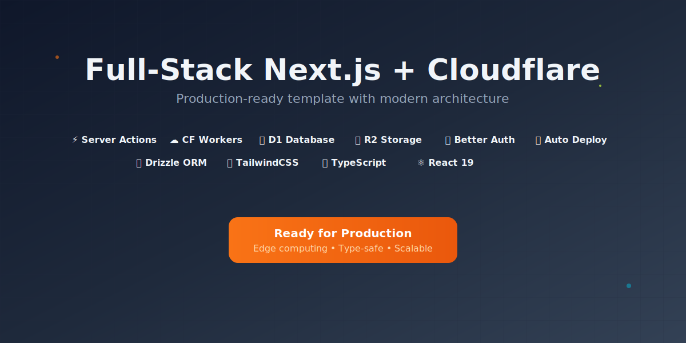

# ⚡ Full-Stack Next.js + Cloudflare 模板

一个生产就绪的全栈应用模板，基于 Next.js 15 和 Cloudflare 边缘基础设施构建。适用于 MVP 开发，提供慷慨的免费额度，并可无缝扩展到企业级应用。

**基于 Cloudflare 官方最佳实践** - 采用 Cloudflare Workers（而非 Pages）的现代化架构，包含完整的 D1 数据库和 R2 对象存储示例，提供开箱即用的全栈开发工作流。经过优化，可在极低成本下支持大规模用户访问。


## 🌟 为什么选择 Cloudflare + Next.js？

**Cloudflare 边缘网络** 提供无与伦比的性能和可靠性：
- ⚡ **超低延迟** - 部署到全球 300+ 节点
- 💰 **慷慨的免费额度** - 非常适合 MVP 和副项目
- 📈 **轻松扩展** - 从零到百万用户自动扩展
- 🔒 **内置安全** - DDoS 防护、WAF 等
- 🌍 **全球默认** - 应用靠近每个用户运行

结合 **Next.js 15**，您将获得现代 React 特性、Server Components 和 Server Actions，实现最佳性能和开发体验。

## 🛠️ 技术栈

### 🎯 **前端**
- ⚛️ **Next.js 15** - App Router + React Server Components (RSC)
- 🎨 **TailwindCSS 4** - 实用优先的 CSS 框架
- 📘 **TypeScript** - 全面类型安全
- 🧩 **Shadcn UI** - 无样式、可访问的组件库
- 📋 **React Hook Form + Zod** - 类型安全的表单处理

### ☁️ **后端与基础设施**
- 🌐 **Cloudflare Workers** - 无服务器边缘计算平台
- 🗃️ **Cloudflare D1** - 边缘分布式 SQLite 数据库
- 📦 **Cloudflare R2** - S3 兼容的对象存储
- 🤖 **Cloudflare Workers AI** - 边缘 AI 推理（开源模型）
- 🔑 **Better Auth** - 现代认证（支持 Google OAuth）
- 🛠️ **Drizzle ORM** - TypeScript 优先的数据库工具包

### 🚀 **DevOps 与部署**
- ⚙️ **GitHub Actions** - 自动化 CI/CD 流水线
- 🔧 **Wrangler** - Cloudflare CLI 工具
- 👁️ **预览部署** - 生产前测试变更
- 🔄 **数据库迁移** - 版本控制的 Schema 变更
- 💾 **自动备份** - 生产数据库安全保障

### 📊 **数据流架构**
- **数据获取**: Server Actions + React Server Components 实现最优性能
- **数据变更**: Server Actions 自动重新验证
- **AI 处理**: Cloudflare Workers AI 边缘推理
- **类型安全**: 端到端 TypeScript（从数据库到 UI）
- **缓存**: Next.js 内置缓存 + Cloudflare 边缘缓存

## 🏗️ 项目结构

本模板采用**功能模块化架构**，便于维护和扩展：

```
src/
├── app/                    # Next.js App Router
│   ├── (auth)/            # 认证相关页面
│   ├── api/               # API 路由（外部访问）
│   │   └── summarize/     # AI 摘要端点
│   ├── dashboard/         # 仪表板页面
│   └── globals.css        # 全局样式
├── components/            # 共享 UI 组件
├── constants/             # 应用常量
├── db/                    # 数据库配置
│   ├── index.ts          # 数据库连接
│   └── schema.ts         # 数据库 Schema
├── lib/                   # 共享工具函数
├── modules/               # 功能模块
│   ├── auth/             # 认证模块
│   │   ├── actions/      # 认证 Server Actions
│   │   ├── components/   # 认证组件
│   │   ├── hooks/        # 认证 Hooks
│   │   ├── models/       # 认证模型
│   │   ├── schemas/      # 认证 Schema
│   │   └── utils/        # 认证工具
│   ├── dashboard/        # 仪表板模块
│   └── todos/            # 待办事项模块
│       ├── actions/      # 待办 Server Actions
│       ├── components/   # 待办组件
│       ├── models/       # 待办模型
│       └── schemas/      # 待办 Schema
├── services/              # 业务逻辑服务
│   └── summarizer.service.ts  # AI 摘要服务
└── drizzle/              # 数据库迁移
```

**核心架构优势：**
- **功能隔离** - 每个模块包含自己的 Actions、组件和逻辑
- **Server Actions** - 现代数据变更 + 自动重新验证
- **React Server Components** - 服务端渲染实现最优性能
- **类型安全** - 端到端 TypeScript（从数据库到 UI）
- **可测试** - 关注点分离，便于测试

## 🚀 快速开始

### 1. 前置条件

- **Cloudflare 账户** - [免费注册](https://dash.cloudflare.com/sign-up)
- **Node.js 20+** 和 **pnpm** 已安装
- **Google OAuth 应用** - 用于认证设置

### 2. 创建 Cloudflare API Token

创建用于 Wrangler 认证的 API Token：

1. 在 Cloudflare 控制台，进入 **Account API tokens** 页面
2. 选择 **Create Token** > 找到 **Edit Cloudflare Workers** > 选择 **Use Template**
3. 自定义 Token 名称（例如 "Next.js Cloudflare Template"）
4. 将 Token 限定到您的账户和区域（如果使用自定义域名）
5. **添加额外权限** 用于 D1 数据库和 AI 访问：
   - Account - D1:Edit
   - Account - D1:Read
   - Account - Cloudflare Workers AI:Read

**最终 Token 权限：**
- "Edit Cloudflare Workers" 模板的所有权限
- Account - D1:Edit（数据库操作）
- Account - D1:Read（数据库查询）
- Account - Cloudflare Workers AI:Read（AI 推理）

### 3. 克隆并设置

```bash
# 克隆仓库
git clone https://github.com/yuanyuanyuan/Full-Stack-Next.js-Cloudflare-Template.git
cd Full-Stack-Next.js-Cloudflare-Template

# 安装依赖
pnpm install
```

### 4. 环境配置

创建环境文件：

```bash
# 复制示例环境文件
cp .dev.vars.example .dev.vars
```

编辑 `.dev.vars` 填入您的凭据：

```bash
# Cloudflare 配置
CLOUDFLARE_ACCOUNT_ID=your-account-id
CLOUDFLARE_D1_TOKEN=your-api-token

# 认证密钥
BETTER_AUTH_SECRET=your-random-secret-here
GOOGLE_CLIENT_ID=your-google-client-id
GOOGLE_CLIENT_SECRET=your-google-client-secret

# 存储
CLOUDFLARE_R2_URL=your-r2-bucket-url
```

### 5. 认证设置

**Better Auth Secret：**
```bash
# 生成随机密钥
openssl rand -base64 32
# 添加到 .dev.vars 的 BETTER_AUTH_SECRET
```

**Google OAuth 设置：**
参考 [Better Auth Google 文档](https://www.better-auth.com/docs/authentication/google)：
1. 创建 Google OAuth 2.0 应用
2. 获取 Client ID 和 Client Secret
3. 添加授权重定向 URI

### 6. 存储设置与 R2 URL 配置

**了解 R2 URLs：**
Cloudflare R2 在开发和生产环境有不同的 URL 行为：

- **开发环境**：R2 提供立即可用的公共 URL
- **生产环境**：R2 公共 URL 不适合生产使用 - 应设置自定义域名

**步骤 1：创建 R2 Bucket**
```bash
# 创建开发用 R2 bucket
wrangler r2 bucket create your-app-bucket-dev

# 生产环境创建独立 bucket
wrangler r2 bucket create your-app-bucket-prod
```

**步骤 2：获取开发环境 R2 URL**

**启用公共开发 URL：**
1. 进入 Cloudflare 控制台
2. 点击侧边栏 "R2 Object Storage"
3. 从列表中选择您的 bucket
4. 进入 "Settings" 标签
5. 找到 "Public Development URL" 部分
6. 点击 "Enable Public URL"
7. 复制显示的 URL（格式：`https://pub-xxxxx.r2.dev`）

**示例 URL 格式：**
```
https://pub-a1b2c3d4e5f6g7h8i9j0.r2.dev
```

**重要说明：**
- URL 由 Cloudflare 自动生成
- 无需账户 ID - 所有信息都在提供的 URL 中
- 此 URL 仅用于开发（非生产）

**步骤 3：将 R2 URL 添加到环境变量**
```bash
# 添加到 .dev.vars 文件（使用从控制台复制的 URL）
CLOUDFLARE_R2_URL=https://pub-a1b2c3d4e5f6g7h8i9j0.r2.dev
```

**注意：** 将示例 URL 替换为您从 R2 bucket 设置中复制的实际 URL。

**生产环境 - 自定义域名设置（必需）：**

⚠️ **重要**：默认 R2 公共 URL 不应在生产中使用，因为它未针对性能优化且可能有限制。

**为 R2 设置自定义域名：**
```bash
# 1. 进入 Cloudflare 控制台 → R2 Storage → Your Bucket → Custom Domains
# 2. 点击 "Connect Domain" 并输入您想要的域名（例如 files.yourdomain.com）
# 3. 按照 Cloudflare 指示更新 DNS 记录
# 4. 等待 SSL 证书颁发（通常几分钟）

# 您的生产 R2 URL 将是：
# https://files.yourdomain.com

# 添加到生产 secrets：
echo "https://files.yourdomain.com" | wrangler secret put CLOUDFLARE_R2_URL
```

**R2 URL 总结：**
- **开发环境**：使用 R2 bucket "Public Development URL" 设置中的 URL
- **生产环境**：必须使用自定义域名以获得更好的性能和可靠性

**R2 URL 工作原理：**
- **基础 URL**：从 R2 bucket 设置获取（格式：`https://pub-xxxxx.r2.dev`）
- **文件 URL**：`https://pub-xxxxx.r2.dev/{folder}/{file-name}.{extension}`
- **环境变量**：仅基础 URL 放入 `CLOUDFLARE_R2_URL`
- **代码**：完整文件路径通过编程方式使用基础 URL 构建

## 🛠️ 手动设置（详细）

如果您更喜欢手动设置或想详细了解每个步骤，请参考此综合指南。

### 步骤 1：创建 Cloudflare 资源

**创建 D1 数据库：**
```bash
# 在边缘创建新的 SQLite 数据库
wrangler d1 create your-app-name

# 输出将显示：
# database_name = "your-app-name"
# database_id = "xxxxxxxx-xxxx-xxxx-xxxx-xxxxxxxxxxxx"
```

**创建 R2 Bucket：**
```bash
# 创建对象存储 bucket
wrangler r2 bucket create your-app-bucket

# 列出 bucket 确认
wrangler r2 bucket list
```

### 步骤 2：配置 Wrangler

使用您的资源 ID 更新 `wrangler.jsonc`：

```jsonc
{
    "name": "your-app-name",
    "d1_databases": [
        {
            "binding": "DB",
            "database_name": "your-app-name",
            "database_id": "your-database-id-from-step-1",
            "migrations_dir": "./src/drizzle"
        }
    ],
    "r2_buckets": [
        {
            "bucket_name": "your-app-bucket",
            "binding": "FILES"
        }
    ],
    "ai": {
        "binding": "AI"
    }
}
```

### 步骤 3：设置认证

**生成 Better Auth Secret：**
```bash
# macOS/Linux
openssl rand -base64 32

# Windows (PowerShell)
[System.Convert]::ToBase64String([System.Security.Cryptography.RandomNumberGenerator]::GetBytes(32))

# 或使用在线生成器：https://generate-secret.vercel.app/32
```

**配置 Google OAuth：**
1. 进入 [Google Cloud Console](https://console.cloud.google.com/)
2. 创建新项目或选择现有项目
3. 启用 Google+ API
4. 创建 OAuth 2.0 凭据
5. 添加授权重定向 URI：
   - `http://localhost:3000/api/auth/callback/google`（开发环境）
   - `https://your-app.your-subdomain.workers.dev/api/auth/callback/google`（生产环境）

### 步骤 4：环境配置

**创建本地环境文件：**
```bash
# .dev.vars 用于本地开发
CLOUDFLARE_ACCOUNT_ID=your-account-id
CLOUDFLARE_D1_TOKEN=your-api-token
BETTER_AUTH_SECRET=your-generated-secret
GOOGLE_CLIENT_ID=your-google-client-id.apps.googleusercontent.com
GOOGLE_CLIENT_SECRET=your-google-client-secret
# 从 R2 bucket 设置获取：R2 Object Storage → Your Bucket → Settings → Public Development URL
CLOUDFLARE_R2_URL=https://pub-a1b2c3d4e5f6g7h8i9j0.r2.dev
```

**设置生产 Secrets：**
```bash
# 将每个 secret 添加到 Cloudflare Workers
echo "your-secret-here" | wrangler secret put BETTER_AUTH_SECRET
echo "your-client-id" | wrangler secret put GOOGLE_CLIENT_ID
echo "your-client-secret" | wrangler secret put GOOGLE_CLIENT_SECRET
echo "your-r2-url" | wrangler secret put CLOUDFLARE_R2_URL
```

### 步骤 5：数据库设置

**生成 TypeScript 类型：**
```bash
# 为 TypeScript 生成 Cloudflare 绑定
pnpm run cf-typegen
```

**初始化数据库：**
```bash
# 从 Schema 生成初始迁移
pnpm run db:generate

# 应用迁移到本地数据库
pnpm run db:migrate:local

# 验证数据库结构
pnpm run db:inspect:local
```

**可选：填充示例数据**
```bash
# 创建并运行填充脚本
wrangler d1 execute your-app-name --local --command="
INSERT INTO todos (id, title, description, completed, created_at, updated_at) VALUES
('1', 'Welcome to your app', 'This is a sample todo item', false, datetime('now'), datetime('now')),
('2', 'Set up authentication', 'Configure Google OAuth', true, datetime('now'), datetime('now'));
"
```

### 步骤 6：测试设置

**启动开发服务器：**
```bash
# 终端 1：启动 Wrangler（提供 D1 访问）
pnpm run wrangler:dev

# 终端 2：启动 Next.js（提供 HMR）
pnpm run dev

# 替代方案：单命令（无 HMR）
pnpm run dev:cf
```

**验证一切正常：**
1. 打开 `http://localhost:3000`
2. 测试认证流程
3. 创建一个待办事项
4. 检查数据库：`pnpm run db:studio:local`

### 步骤 7：设置 GitHub Actions（可选）

**添加仓库 Secrets：**
进入 GitHub 仓库 → Settings → Secrets 添加：

- `CLOUDFLARE_API_TOKEN` - 步骤 2 中的 API Token
- `CLOUDFLARE_ACCOUNT_ID` - 您的账户 ID
- `BETTER_AUTH_SECRET` - 您的认证密钥
- `GOOGLE_CLIENT_ID` - 您的 Google Client ID
- `GOOGLE_CLIENT_SECRET` - 您的 Google Client Secret
- `CLOUDFLARE_R2_URL` - 您的 R2 bucket URL

**部署生产数据库：**
```bash
# 应用迁移到生产环境
pnpm run db:migrate:prod

# 验证生产数据库
pnpm run db:inspect:prod
```

## 🔧 高级手动配置

### 自定义域名设置

**添加自定义域名：**
1. 进入 Cloudflare 控制台 → Workers & Pages
2. 选择您的 worker → Settings → Triggers
3. 点击 "Add Custom Domain"
4. 输入您的域名（必须在您的 Cloudflare 账户中）

**更新 OAuth 重定向 URL：**
将您的自定义域名添加到 Google OAuth 设置：
- `https://yourdomain.com/api/auth/callback/google`

### 数据库优化

**添加索引提升性能：**
```sql
-- 创建索引以提升查询性能
CREATE INDEX IF NOT EXISTS idx_todos_user_id ON todos(user_id);
CREATE INDEX IF NOT EXISTS idx_todos_created_at ON todos(created_at);
CREATE INDEX IF NOT EXISTS idx_todos_completed ON todos(completed);
```

**监控数据库性能：**
```bash
# 查看数据库洞察
wrangler d1 insights your-app-name --since 1h

# 导出数据用于分析
wrangler d1 export your-app-name --output backup.sql
```

### R2 存储配置

**配置 CORS 支持直接上传：**
```bash
# 创建 CORS 策略文件
echo '[
  {
    "AllowedOrigins": ["https://yourdomain.com", "http://localhost:3000"],
    "AllowedMethods": ["GET", "PUT", "POST", "DELETE"],
    "AllowedHeaders": ["*"],
    "ExposeHeaders": [],
    "MaxAgeSeconds": 3000
  }
]' > cors.json

# 应用 CORS 策略
wrangler r2 bucket cors put your-app-bucket --file cors.json
```

## 🏃‍♂️ 开发工作流

### 初始设置
```bash
# 1. 生成 Cloudflare 类型（wrangler.jsonc 变更后运行）
pnpm run cf-typegen

# 2. 应用数据库迁移
pnpm run db:migrate:local

# 3. 为 Cloudflare 构建应用
pnpm run build:cf
```

### 日常开发
```bash
# 终端 1：启动 Wrangler 用于 D1 数据库访问
pnpm run wrangler:dev

# 终端 2：启动 Next.js 开发服务器（支持 HMR）
pnpm run dev
```

**开发 URL：**
- 🌐 **Next.js（HMR）**：`http://localhost:3000`（推荐）
- ⚙️ **Wrangler Dev Server**：`http://localhost:8787`

### 替代开发选项
```bash
# 单命令 - Cloudflare 运行时（无 HMR）
pnpm run dev:cf

# 使用远程 Cloudflare 资源测试
pnpm run dev:remote
```

## 📜 可用脚本

### **核心开发**
| 脚本 | 描述 |
|--------|-------------|
| `pnpm dev` | 启动 Next.js（支持 HMR） |
| `pnpm run build:cf` | 为 Cloudflare Workers 构建 |
| `pnpm run wrangler:dev` | 启动 Wrangler 用于本地 D1 访问 |
| `pnpm run dev:cf` | 组合构建 + Cloudflare 开发服务器 |

### **数据库操作**
| 脚本 | 描述 |
|--------|-------------|
| `pnpm run db:generate` | 生成新迁移 |
| `pnpm run db:generate:named "migration_name"` | 生成命名迁移 |
| `pnpm run db:migrate:local` | 应用迁移到本地 D1 |
| `pnpm run db:migrate:preview` | 应用迁移到预览环境 |
| `pnpm run db:migrate:prod` | 应用迁移到生产环境 |
| `pnpm run db:studio:local` | 打开 Drizzle Studio（本地数据库） |
| `pnpm run db:inspect:local` | 列出本地数据库表 |
| `pnpm run db:reset:local` | 重置本地数据库 |

### **部署与生产**
| 脚本 | 描述 |
|--------|-------------|
| `pnpm run deploy` | 部署到生产环境 |
| `pnpm run deploy:preview` | 部署到预览环境 |
| `pnpm run cf-typegen` | 生成 Cloudflare TypeScript 类型 |
| `pnpm run cf:secret` | 添加 secrets 到 Cloudflare Workers |

### **开发顺序**

**首次设置：**
1. `pnpm run cf-typegen` - 生成类型
2. `pnpm run db:migrate:local` - 设置数据库
3. `pnpm run build:cf` - 构建应用

**日常开发：**
1. `pnpm run wrangler:dev` - 启动 D1 访问（终端 1）
2. `pnpm run dev` - 启动 Next.js（支持 HMR）（终端 2）

**Schema 变更后：**
1. `pnpm run db:generate` - 生成迁移
2. `pnpm run db:migrate:local` - 应用到本地数据库

**wrangler.jsonc 变更后：**
1. `pnpm run cf-typegen` - 重新生成类型

## 🤖 AI 开发与测试

### 测试 AI API

**⚠️ 需要认证**：先登录应用，然后测试 API。

**浏览器控制台（最简单）：**
1. 在 `http://localhost:3000` 登录
2. 打开 DevTools 控制台（F12）
3. 运行：
```javascript
fetch('/api/summarize', {
  method: 'POST',
  headers: { 'Content-Type': 'application/json' },
  credentials: 'include',
  body: JSON.stringify({
    text: "Your text to summarize here...",
    config: { maxLength: 100, style: "concise" }
  })
}).then(r => r.json()).then(console.log);
```

**cURL（带 session cookies）：**
1. 先在浏览器登录
2. DevTools → Application → Cookies → 复制 `better-auth.session_token`
3. 在 cURL 中使用 cookie：
```bash
curl -X POST http://localhost:3000/api/summarize \
  -H "Content-Type: application/json" \
  -H "Cookie: better-auth.session_token=your-token-here" \
  -d '{"text": "Your text here...", "config": {"maxLength": 100}}'
```

**Postman：**
1. 在浏览器登录，从 DevTools 复制 session cookie
2. 添加 header：`Cookie: better-auth.session_token=your-token-here`

**未认证请求响应：**
```json
{
  "success": false,
  "error": "Authentication required",
  "data": null
}
```


### AI 服务架构

AI 集成遵循清晰的基于服务的架构：

1. **API 路由** (`/api/summarize`) - 处理 HTTP 请求、认证和验证
2. **认证层** - 处理请求前验证用户会话
3. **SummarizerService** - 封装 AI 业务逻辑
4. **错误处理** - 全面的错误响应和正确的状态码
5. **类型安全** - 完整的 TypeScript 支持和 Zod 验证

### AI 模型选项

Cloudflare Workers AI 支持多种模型：
- **@cf/meta/llama-3.2-1b-instruct** - 文本生成（当前使用）
- **@cf/meta/llama-3.2-3b-instruct** - 更强大的文本生成
- **@cf/meta/m2m100-1.2b** - 翻译
- **@cf/baai/bge-base-en-v1.5** - 文本嵌入
- **@cf/microsoft/resnet-50** - 图像分类

## 🔧 高级配置

### 数据库 Schema 变更
```bash
# 1. 修改 src/db/schemas/ 中的 schema 文件
# 2. 生成迁移
pnpm run db:generate:named "add_user_table"
# 3. 应用到本地数据库
pnpm run db:migrate:local
# 4. 测试变更
# 5. 提交并部署（迁移自动运行）
```

### 添加新的 Cloudflare 资源
```bash
# 1. 使用新资源更新 wrangler.jsonc
# 2. 重新生成类型
pnpm run cf-typegen
# 3. 更新代码使用新绑定
```

### 生产环境 Secrets 管理
```bash
# 添加 secrets 到生产环境
pnpm run cf:secret BETTER_AUTH_SECRET
pnpm run cf:secret GOOGLE_CLIENT_ID
pnpm run cf:secret GOOGLE_CLIENT_SECRET
```

## 📊 性能与监控

**内置可观测性：**
- ✅ Cloudflare Analytics（默认启用）
- ✅ 真实用户监控（RUM）
- ✅ 错误跟踪和日志
- ✅ 性能指标

**数据库监控：**
```bash
# 监控数据库性能
wrangler d1 insights next-cf-app

# 在 Cloudflare Dashboard 查看数据库指标
# 导航：Workers & Pages → D1 → next-cf-app → Metrics
```

## 🚀 部署

### 自动部署（推荐）

推送到 `main` 分支触发 GitHub Actions 自动部署：

```bash
git add .
git commit -m "feat: add new feature"
git push origin main
```

**部署流水线：**
1. ✅ 安装依赖
2. ✅ 构建应用
3. ✅ 运行数据库迁移
4. ✅ 部署到 Cloudflare Workers

### 手动部署

```bash
# 部署到生产环境
pnpm run deploy

# 部署到预览环境
pnpm run deploy:preview
```

## ✍️ 待办事项

### 🤖 AI 功能
- [ ] 使用 `@cf/meta/m2m100-1.2b` 添加文本翻译服务
- [ ] 使用 `@cf/baai/bge-base-en-v1.5` 实现语义搜索的文本嵌入
- [ ] 使用 `@cf/microsoft/resnet-50` 添加图像分类 API
- [ ] 创建带对话记忆的聊天/对话 API
- [ ] 添加 AI 分类的内容审核
- [ ] 为用户反馈实现情感分析

### 💳 支付与通信
- [ ] 使用 [Resend](https://resend.com/) 和 [Cloudflare Email Routing](https://www.cloudflare.com/developer-platform/products/email-routing/) 实现邮件发送
- [ ] 使用 [Polar.sh](https://polar.sh/) 实现国际支付网关
- [ ] 使用 [Xendit](https://www.xendit.co/en-id/)、[Midtrans](https://midtrans.com/en) 或 [Duitku](https://www.duitku.com/) 实现印尼支付网关

### 📊 分析与性能
- [ ] 添加 Cloudflare Analytics 集成
- [ ] 实现自定义指标跟踪
- [ ] 添加性能监控仪表板
- [ ] 创建 AI 使用分析和成本跟踪


## 🤝 贡献

欢迎贡献！请随时提交 Issues 和 Pull Requests。

## 📝 许可证

本项目采用 MIT 许可证 - 详见 [LICENSE](LICENSE) 文件。

---

© 2025 StarkYuan. All rights reserved.
